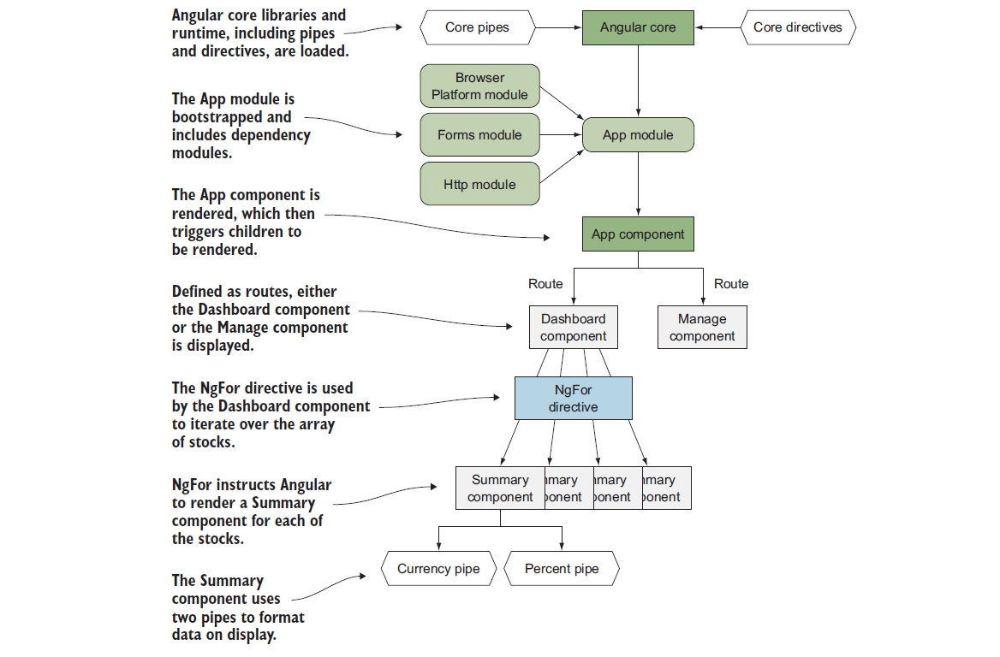

# App Essentials
#### This chapter covers the essentials of Angular applications so that you can understand how everything fits together. It will be a good reference for the fundamentals. It is focused on concepts, and there are no coding projects. You may be eager to jump into coding, and I certainly understand that. I recommend you take the time to read this chapter in its entirety, but you can also start by skimming the first couple paragraphs of each section. While in college, I studied abroad in Germany and was fortunate enough to do some traveling. I took a number of tours, but two I remember well were a tour of some salt mines in southern Germany and a tour of the Uffizi Museum in Florence, Italy. I learned a lot of interesting facts about salt mines, but I had no real background in mining. On the other hand, I had been taking an art history class, which made the experience of the Uffizi Museum far more satisfying.


## Entities in Angular
#### Angular has several top-level types of entities, and we will disscuss them from the context of how they are bundled and rendered into the application.
#### These different entities have specific roles and capabilities, and you’ll be using them in various combinations to create your application. Here is a quick overview of the types:
* **Modules** —Objects that help you to organize dependencies into discrete units
* **Components** —New elements that will compose the majority of your application’s structure and logic
* **Directives** —Objects that modify elements to give them new capabilities or change behaviors
* **Pipes** —Functions that format data before it’s rendered 
* **Services** —Reusable objects that fill niche roles such as data access or helper utilities 

#### For the most part, everything you write in Angular will fall into one of these five types (okay, I’m sure there are some exceptions). Looking at our stock application from, we can see how these different entities came into play. 
#### This figure outlines the basic relationship of the entities and how they ultimately fit together.


#### As you can see, all these entities are ultimately merged into one application and are what generate the resulting user experience. 

## Modules
* Modules are buckets for storing related entities for easy reuse and distribution. Angular itself is composed of several modules, and any external libraries that you consume will also be packaged as modules.
* There are two kinds of modules in Angular, and we need to clarify the difference.
* There are JavaScript modules (specifically modules added to the language in ES2015, and not other module systems like CommonJS and AMD), and then there are Angular modules.
* JavaScript modules are language constructs and are a way to separate code into different files that can be loaded as needed. We leverage JavaScript modules heavily in our code, but they are not Angular modules. Every TypeScript file we wrote in chapter 2 was a JavaScript module because it either imported or exported some values.
* Whereas JavaScript modules are language constructs, Angular modules are logical constructs used for organizing similar groups of entities (such as all things needed for the router) and are used by Angular to understand what needs to be loaded as well as what dependencies exist. 
* Recall from chapter 2 that your application has an App module that holds a reference to all the application logic for Angular to render. 
* There must always be an App module, but there will likely be additional modules in your application— either official Angular modules, third-party ones, or other ones you may create.
* A module is declared by creating a class and decorating it with the @NgModule decorator.
* The following listing shows the module we created for the chapter 2 stocks example.

```typescript
@NgModule({
declarations: [
AppComponent,
SummaryComponent
],
imports: [
BrowserModule,
FormsModule,
HttpModule
],
providers: [StocksService],
bootstrap: [AppComponent]
})
export class AppModule { }
```
* This module declaration was generated by the CLI for us (though we could have written it ourselves), and it provides key pieces of information to Angular so it can understand how to render and load the application. 
* The `@NgModule` decorator contains the metadata for the App module, and the empty class acts as the **vessel** for storing the data.
* The declarations array contains a list of all components and directives that the application’s main module wants to make available to the entire application. 
* Likewise, the providers array contains a list of all of the services that you want to make available to the whole application.
* The imports array contains a list of the other modules that this module depends upon. 
* If you’re having trouble with another module not loading, this is the first place to check to see if it’s being registered with Angular.
* To start rendering, Angular also needs to know what component(s) to render on the screen, and it looks at the bootstrap array for this list. 
* Almost always, this will only contain one component, but in some rare cases you may need to render multiple components on load.
* There are a few additional properties you don’t see listed here, but they’re less commonly used.

## Components
* Understanding components is vital to understanding Angular, as understanding words is vital to language. 
* We’ll be focusing on the role and design of components in this section before we dive into the technical implementation details.
* A component is an encapsulated element that maintains its own internal logic for how it desires to render some output, such as our Summary component from chapter 2. In HTML, a select element can be considered a component. 
* Using Angular, we create our own HTML elements using components, though they are more than that. Components can have any number of capabilities or properties that you define.
* As a review, here are the key principles of a component discussed in chapter 1, where we saw some of the web technologies that make it possible to build components. 
* These principles focus on the way that components are best designed and how they behave in Angular:
* **Encapsulation** —Keep component logic isolated
* **Isolation** —Keep component internals hidden
* **Reusability** —Allow component reuse with minimal effort
* **Event-based** —Emit events during the lifecycle of the component
* **Customizable** —Possible to style and extend the component
* **Declarative** —Component used with simple declarative markup

* Components may not implement all of these principles, but they should certainly be a guidepost for your thinking. It also helps to keep track of how components relate to one another—you can nest multiple components together to compose a more complex interaction.
* Let’s take an example of a login form using only HTML elements. 
* You start any form with the form element that wraps the entire form structure. 
* This gives context to the rest of the elements inside the form, but it doesn’t provide any UI elements for the user to interact with. 
* For that, we’d need to use a text input for the username, a password input for the password, and some kind of button to trigger the form action. 
* In figure 3.3 we have a basic example of a form from Facebook™ that contains these elements.
* Form events are provided access to the values of the inputs inside the form. This is like the Angular notion of data binding, where values from one element are connected to another. Then the form has a submit button, which when clicked triggers the submit event for the form.
* This should be pretty standard HTML, but now let’s look at a combination of Angular components in a similar arrangement. In chapter 2, we had a Dashboard component that contained multiple instances of the Summary component. 
* In figure 3.4, I’ve outlined the two types of components.
* The Dashboard component holds the data for all the stocks and binds that information into the individual Summary components. 
* Each Summary component uses the provided stock data to display itself. 
* Any changes in the dashboard data will cause the child Summary components to be updated.
* The basic interaction of components is to push data down from parent components, usually through binding, and back up, usually through events. 
* There are other ways for components to communicate (something I cover in more detail later), but much of your time working with Angular will be composing trees of components into a meaningful interface.

## Directives
* Angular favors putting logic and capabilities straight into the `HTML` markup of the application, and directives are a powerful tool to teach `HTML` elements new skills. 
* You likely have used jQuery plugins in the past to enhance existing elements with new behaviors. 
* There are endless plugins to turn regular elements into slideshows, tabs, and other things. The way these plugins work is that they take an existing element and apply new capabilities, such as making an image open up in a modal window.
* Similarly, directives can take a normal element and give it additional capabilities that don’t exist naturally. 
* Imagine you’re building a form in which it’s important that the user doesn’t accidentally click any links to navigate away. 
* You could create a directive that can disable links depending on whether the user has started to use the form or if they’ve completed it, and internally it would modify the anchor link to disable the href and therefore the clickability of the link.
* Let’s look back to chapter 2 again and see how we used different directives to give regular elements new skills. 
* Figure 3.5 shows the directives used on the dashboard view, which has NgFor, NgClass, and `NgIf`. 
* The figure is annotated with how these directives changed the element behavior.
* Here is one that adds a directive that will render or remove the element based on the value inside the attribute value (known as an expression):

```html
<div *ngIf="!stocks">
```
* The `*ngIf` is the directive, which is applied as an attribute to the element, and it will evaluate the value it’s assigned to. 
* In this case, if the expression is truthy, it will render the element—otherwise it will remove it from the DOM. 
* `NgIf` gives an element the ability to conditionally render or be removed, which is possibly the most common use of JavaScript on the web. 
* There are three categories of directives: attribute directives, structural directives,and components. 
* We already talked about components, and it should make sense how a component adds new capabilities to `HTML`, making it also a directive. 
* But components are special because they’re the only type of directive with a template, and therefore I suggest thinking of them as their own type of entity.
* Attribute directives are like our earlier example, where they modify the appearance or behavior of an element. 
* The `NgClass` directive is one such example provided by Angular out of the box, which we saw in chapter 2. 
* There are a number of built-in attribute directives, so you won’t necessarily have to build many of your own. 
* Typically, they work by changing the various properties of the element they are associated with, such as the `NgClass` directive changing the list of classes attached. Most directives are attribute directives.
* On the other hand, structural directives modify the DOM tree based on some conditions.
* In chapter 2 we also saw NgIf as a way to conditionally display a DOM element, and NgFor as a way to iterate over a list of items and display them. 
* There are fewer of these types of directives built into Angular because they’re versatile. They work by adding or removing DOM elements to or from the page.
* We used three directives in chapter 2, as outlined in figure 3.5. NgIf was used to hide the cards list until the data had loaded. NgFor was used to loop over each stock and create N number of copies.
* Then `NgClass` was used to change the card background, depending on the positive or negative change for the stock price. But we didn’t go into detail about some of the other directives.
* The primary default directives provided by Angular consist of the following (there are also some provided by the Forms and Router modules):
    * **NgClass** —Conditionally apply a class to an element
    * **NgStyle** —Conditionally apply a set of styles to an element
    * **NgIf** —Conditionally insert or remove an element from the DOM
    * **NgFor** —Iterate over a collection of items
    * **NgSwitch** —Conditionally display an item from a set of options
* Without directives in the stock application, we would have to write JavaScript that would dynamically create multiple summary cards, and that gets harder to manage over time. 
* Directives make life much easier because they modify an element to give it a new capability, without having to use JavaScript to reach into the template and modify it on the fly. 
* We don’t have to use something like jQuery to modify the DOM and put our logic in an external, dissociated location.